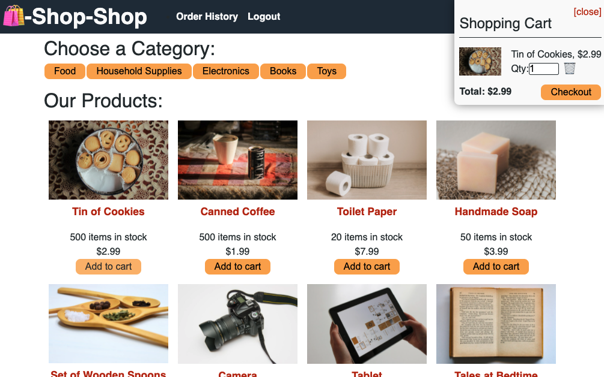

# Project Title
Challenge 22

# Description
This project involves refactoring a fully functional e-commerce website to use Redux.

Follow this [link](https://github.com/abergtra/challenge-22) for the GitHub repository.

# Table of Contents 
* [Installation](#-Installation)
* [Usage](#-Usage)
* [License](#-Installation)
* [Contributing](#-Contributing)
* [Tests](#-Tests)
* [Questions](#-Questions)
    
# Installation
Navigate to the live url. No installation necessary!

# Usage
Follow the [live url](https://challenge-22.herokuapp.com/) to access the ecommerce site!

Sign Up:

New Home page after Logging in:

Add a product to Cart:

Buy Products:

Check out just one category of product:

# License 
[License: MIT](https://opensource.org/licenses/MIT) 
* As this list provided is not comprehensive, if you need another license, contact the author for additional options. 

# Contributing 
Please contact the author about contributing.

# Tests
There are no tests available for this application.

# Questions
* GitHub Username: abergtra
* Contact Email: asher.bergtraun@gmail.com